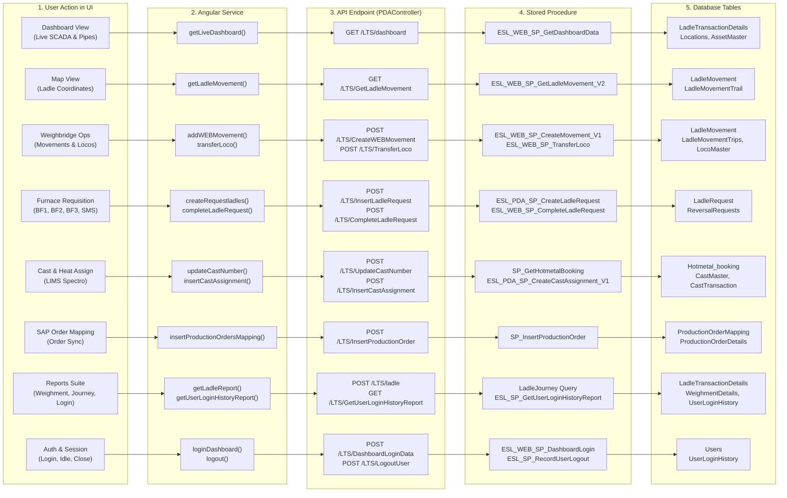

# ESL Ladle Movement Dashboard - Complete Navbar & Component Master Documentation
## UI Components, Buttons, API Endpoints, DAL Methods, Stored Procedures & Database Tables

This document provides an exhaustive, button-by-button mapping of every feature and menu item present in the **Navbar** (`navbar.component.html`), connecting the Frontend (Angular), Application API (ASP.NET Web API 2 / C#), Data Access Layer (`PDADAL`), Stored Procedures, and Database Tables (SQL Server).

---

---

### 1. Complete System Architecture Diagram (Entire UI Ecosystem)

The following diagram illustrates the **complete architecture of the entire ESL Ladle Tracking & Management System**, covering every screen in the UI, client services, backend API controllers, business logic engines, field hardware telemetry, database stored procedures, and relational tables.

```mermaid
graph TB
    %% =========================================================================
    %% TIER 1: FRONTEND SINGLE PAGE APPLICATION (ANGULAR 12+)
    %% =========================================================================
    subgraph "TIER 1: CLIENT PRESENTATION LAYER (Angular 12+ SPA)"
        subgraph "Layout & Global Controls"
            NAV["NavbarComponent<br/>(Sidebar Menu Drawer & Top Header)"]
            THEME_CTRL["Theme Engine<br/>(Dark Mode / Light Mode)"]
            IDLE_CTRL["UserActivityService<br/>(15-Min Inactivity Auto-Logout)"]
            BEACON_CTRL["AppComponent<br/>(Window Unload Beacon Dispatcher)"]
        end

        subgraph "1. Real-Time Operations & Tracking Screens"
            UI_DASH["EsldashboardComponent / DashboardComponent<br/>• Live SCADA Telemetry & Dynamic Pipe SVG<br/>• Heat Turnaround Times & Hold Time Metrics<br/>• LIMS Chemical Chemistry Modal"]
            UI_MAP["MapComponent<br/>• Live Spatial Plant Layout & Track Nodes<br/>• Real-Time Ladle Coordinate Polling<br/>• Station Zoom, Pan & Dwell Inspection"]
            UI_HOME["HomeComponent (Weighbridge Operations)<br/>• Create Ladle Movement Trips<br/>• Couple / Transfer Locomotives<br/>• Reversal Requisitions & Dispatch"]
            UI_LOCO["LocoLadleMovementComponent<br/>• Locomotive-to-Ladle Telemetry Pairing<br/>• Yard Fleet Allocation & Status"]
        end

        subgraph "2. Plant Shop Floor Requisition Screens"
            UI_BF["EslBlastFurnaceComponent (BF1, BF2, BF3)<br/>• Empty Ladle Requisition Dispatch<br/>• Tapping Cast Assignment Mapping<br/>• Request Modification / Cancellation"]
            UI_PROD["EslProductionComponent (SMS, DIP, PCM)<br/>• Incoming Hot Metal Verification<br/>• Gross / Tare Weight Confirmation<br/>• Hot Metal Reversal Requisition"]
            UI_MAINT["EslMaintenanceComponent (LRS Shop)<br/>• Ladle Refractory Inspection<br/>• Ladle De-skulling & Maintenance Close<br/>• Return to Service Approval"]
            UI_PEND["PendingRequestComponent<br/>• Active Requisition Approval Queue<br/>• Yard Empty Ladle Allocation"]
            UI_COMP["CompletedRequestComponent<br/>• Historical Fulfilled Trip Archive"]
        end

        subgraph "3. Metallurgy, SAP ERP & Hardware Diagnostics"
            UI_CAST["CastAssignmentComponent<br/>• Hot Metal Heat / Cast Number Update<br/>• Spectro Chemistry (C, Si, Mn, S, P, Ti, Cr)<br/>• Ladle RFID Tag to Heat Association"]
            UI_SAP["ProductionOrderMappingComponent<br/>• SAP / ERP Production Order Input<br/>• Prefix Rule Assignment per Furnace<br/>• Target Steel Grade Mapping"]
            UI_SYS["SystemStatusComponent / ReaderstatusComponent<br/>• RFID Gate Antenna Ping Health<br/>• OCR Visual Capture Recognition Health<br/>• Windows Service Telemetry Heartbeat"]
        end

        subgraph "4. Operational & Audit Reporting Suite"
            UI_REP_JOURNEY["LadlereportComponent<br/>• End-to-End Round Trip Ladle Journey<br/>• Station Dwell Visual Timeline"]
            UI_REP_DEPT["DepartmentreportComponent<br/>• Departmental TAT, Hold Time & Tonnage"]
            UI_REP_WEIGH["LadleWeighmentReportComponent<br/>• Gross, Tare, Net Weighment Audit<br/>• Scale Calibration & Weight Discrepancies"]
            UI_REP_SLAG["SlagReportComponent<br/>• Slag Pot Tonnage & Skull Tare Increment"]
            UI_REP_AUTO["ManualVsAutoReportComponent<br/>• RFID Auto-Detection vs Manual Override %"]
            UI_REP_LOGIN["UserLoginHistoryReportComponent<br/>• Audit Log of Logins, Durations & Logouts<br/>• PDF / Excel Export Engine"]
        end

        subgraph "Angular Shared Services"
            SVC_MAIN["MainserviceService<br/>(Central HTTP REST Client)"]
            SVC_THEME["ThemeService"]
            SVC_LAYOUT["LayoutService"]
            SVC_CONFIG["AppConfigService"]
        end
    end

    %% UI to Services
    NAV --> UI_DASH & UI_MAP & UI_HOME & UI_LOCO
    NAV --> UI_BF & UI_PROD & UI_MAINT & UI_PEND & UI_COMP
    NAV --> UI_CAST & UI_SAP & UI_SYS
    NAV --> UI_REP_JOURNEY & UI_REP_DEPT & UI_REP_WEIGH & UI_REP_SLAG & UI_REP_AUTO & UI_REP_LOGIN

    UI_DASH & UI_MAP & UI_HOME & UI_LOCO --> SVC_MAIN
    UI_BF & UI_PROD & UI_MAINT & UI_PEND & UI_COMP --> SVC_MAIN
    UI_CAST & UI_SAP & UI_SYS --> SVC_MAIN
    UI_REP_JOURNEY & UI_REP_DEPT & UI_REP_WEIGH & UI_REP_SLAG & UI_REP_AUTO & UI_REP_LOGIN --> SVC_MAIN
    IDLE_CTRL -.->|"Auto Logout on Idle"| SVC_MAIN
    BEACON_CTRL -.->|"sendBeacon on Unload"| SVC_MAIN

    %% =========================================================================
    %% TIER 2: REVERSE PROXY & GATEWAY
    %% =========================================================================
    subgraph "TIER 2: WEB HOSTING & GATEWAY TIER"
        IIS["IIS 10.0 Web Server (HTTP Host / Reverse Proxy)<br/>• Production: http://172.17.20.10:100<br/>• Local Dev: http://localhost:40000<br/>• Cross-Origin Resource Sharing (CORS) Handling"]
    end

    SVC_MAIN -->|"HTTP POST / GET (JSON Payloads)"| IIS

    %% =========================================================================
    %% TIER 3: APPLICATION API & BUSINESS ENGINES
    %% =========================================================================
    subgraph "TIER 3: BACKEND API & BUSINESS LAYER (ASP.NET Web API 2 / C# .NET 4.8)"
        API_GATEWAY["PDAController (RoutePrefix: 'LTS')<br/>• PostDashboardLoginData / DashboardLogout / LogoutUser<br/>• GetDashboardData / GetLadleMovement / CreateWEBMovement<br/>• InsertLadleRequest / UpdateLadleRequest / CompleteLadleRequest<br/>• GetHotmetalBooking / UpdateCastNumber / InsertProductionOrder<br/>• GetUserLoginHistoryReport / GetLadleWeighmentReport"]

        subgraph "Application Core Services"
            DAL["PDADAL (Data Access Layer)<br/>• Dapper High-Performance Micro-ORM<br/>• Parameterized Stored Procedure Execution<br/>• Multi-Dataset Result Mapping"]
            AD_SVC["ADAuthService<br/>• Multi-Base LDAP Protocol Engine<br/>• Kerberos & Domain Simple Bind<br/>• Active Directory Error Parser"]
            TRACKER_ENG["LadleTracker Engine (PSL.Infinity.ESLLadleTracker)<br/>• SCADA State Machine Transitions<br/>• Dwell & Turnaround Calculation Core"]
        end
    end

    IIS --> API_GATEWAY
    API_GATEWAY --> DAL
    DAL --> AD_SVC
    DAL --> TRACKER_ENG

    %% =========================================================================
    %% TIER 4: FIELD HARDWARE & EXTERNAL DIRECTORY
    %% =========================================================================
    subgraph "TIER 4: FIELD HARDWARE & ENTERPRISE DIRECTORY"
        AD_DC["Active Directory Domain Controller<br/>• Host: 172.17.20.121 (Port 389 / 636)<br/>• Domain: ESL01.VEDANTARESOURCE.LOCAL"]
        RFID_READERS["Fixed RFID Gate Readers<br/>• BF Tapping, WB Scales, SMS Bay Entrances"]
        WB_SCALES["Weighbridge Digital Scale Indicators<br/>• Automatic Gross & Tare Signal Acquisition"]
        OCR_CAMERAS["Optical Vision Cameras<br/>• Ladle Number Identification"]
    end

    AD_SVC -.->|"LDAP Directory Query"| AD_DC
    RFID_READERS & WB_SCALES & OCR_CAMERAS -.->|"Field Telemetry Data"| TRACKER_ENG

    %% =========================================================================
    %% TIER 5: DATABASE LAYER (MICROSOFT SQL SERVER 2019)
    %% =========================================================================
    subgraph "TIER 5: DATABASE TIER (Microsoft SQL Server 2019 - ESLLadleDB_Prod)"
        subgraph "Stored Procedures by Functional Area"
            SP_AUTH["Authentication & Session SPs:<br/>• ESL_WEB_SP_DashboardLogin<br/>• ESL_PDA_SP_LoginData<br/>• ESL_SP_RecordUserLogout<br/>• ESL_WEB_SP_Logout"]
            SP_MOVE["Ladle Tracking & Movement SPs:<br/>• ESL_WEB_SP_GetDashboardData<br/>• ESL_WEB_SP_GetLadleMovement_V2<br/>• ESL_WEB_SP_CreateMovement_V1<br/>• ESL_WEB_SP_CreateMovementTrips<br/>• ESL_WEB_SP_GetLadleMovementTrailLocation<br/>• ESL_WEB_SP_DeleteLadleFromMovement_V4"]
            SP_LOCO["Locomotive Management SPs:<br/>• ESL_WEB_SP_GetAllLocoOccupied<br/>• ESL_WEB_SP_AssignedLocoToLadle<br/>• ESL_WEB_SP_TransferLoco<br/>• ESL_WEB_SP_GetLatestLocoLadleMapping"]
            SP_REQ["Shop Requisition & Reversal SPs:<br/>• ESL_PDA_SP_CreateLadleRequest<br/>• ESL_PDA_SP_UpdateLadleRequest<br/>• ESL_WEB_SP_GetLadleRequest_V1<br/>• ESL_WEB_SP_CompleteLadleRequest<br/>• ESL_PDA_SP_RequestReversalLadles_V1<br/>• ESL_WEB_SP_InsertLadleReversal_V4<br/>• ESL_PDA_SP_CloseLadleMovement_V2"]
            SP_HEAT["Cast, Metallurgy & SAP Orders SPs:<br/>• SP_GetHotmetalBooking<br/>• ESL_PDA_SP_CreateCastAssignment_V1<br/>• SP_InsertProductionOrder<br/>• SP_GetProductionReport<br/>• SP_GetPrefixByLocation"]
            SP_REP["Audit & Analytics Reporting SPs:<br/>• ESL_SP_GetUserLoginHistoryReport<br/>• ESL_SP_GetLoginReportUsers<br/>• ESL_WEB_SP_GetLadleWeighmentReport<br/>• ESL_WEB_SP_GetTransactionReport<br/>• ESL_WEB_SP_GetManualVsAutoAssignmentReport<br/>• ESL_WEB_SP_GetSystemStatus"]
        end

        subgraph "Relational Tables by Domain"
            TBL_USER["User & Session Domain:<br/>• [dbo].[Users]<br/>• [dbo].[UserLoginHistory]"]
            TBL_LOGISTICS["Logistics & Fleet Domain:<br/>• [dbo].[LadleMovement]<br/>• [dbo].[LadleMovementTrips]<br/>• [dbo].[LadleMovementTrail]<br/>• [dbo].[LocoMaster]<br/>• [dbo].[LocoLadleMapping]"]
            TBL_REQUISITION["Requisition Domain:<br/>• [dbo].[LadleRequest]<br/>• [dbo].[ReversalRequests]"]
            TBL_TRANSACTION["Telemetry & Weight Domain:<br/>• [dbo].[LadleTransactionDetails]<br/>• [dbo].[WeighmentDetails]<br/>• [dbo].[SlagDetails]<br/>• [dbo].[Audit_Overrides]"]
            TBL_METALLURGY["Heat & Chemistry Domain:<br/>• [dbo].[Hotmetal_booking]<br/>• [dbo].[HotMetal_ChemistryBF2]<br/>• [dbo].[CastMaster]<br/>• [dbo].[CastTransaction]"]
            TBL_ERP["ERP & Hardware Master Domain:<br/>• [dbo].[ProductionOrderMapping]<br/>• [dbo].[ProductionOrderDetails]<br/>• [dbo].[AssetMaster]<br/>• [dbo].[Locations]<br/>• [dbo].[ReaderMaster]<br/>• [dbo].[ServiceHeartBeat]"]
        end
    end

    %% DAL to Stored Procedures
    DAL -->|"Execute Dapper Query"| SP_AUTH & SP_MOVE & SP_LOCO & SP_REQ & SP_HEAT & SP_REP

    %% Stored Procedures to Tables
    SP_AUTH --> TBL_USER
    SP_MOVE --> TBL_LOGISTICS & TBL_TRANSACTION & TBL_ERP
    SP_LOCO --> TBL_LOGISTICS
    SP_REQ --> TBL_REQUISITION & TBL_TRANSACTION
    SP_HEAT --> TBL_METALLURGY & TBL_ERP
    SP_REP --> TBL_USER & TBL_TRANSACTION & TBL_LOGISTICS & TBL_ERP
```



---

### 2. Functional Data Flow Architecture (User Interaction ➔ DB Execution)

The following architectural flow shows how each user action in the UI travels through the routing engine, services, API endpoints, DAL methods, stored procedures, and tables:



---

### Table of Contents
0. [Complete System Architecture Diagram](#1-complete-system-architecture-diagram-entire-ui-ecosystem)
1. [Header Actions & Navigation Controls](#1-header-actions--navigation-controls)
1. [Header Actions & Navigation Controls](#1-header-actions--navigation-controls)
2. [Sidebar Menu 1: Live Dashboard (Telemetry & Overview)](#2-sidebar-menu-1-live-dashboard)
3. [Sidebar Menu 2: MAP (Live Plant Tracking Map)](#3-sidebar-menu-2-map)
4. [Sidebar Menu 3: Ladle Movement (Weighbridge & Yard Operations)](#4-sidebar-menu-3-ladle-movement)
5. [Sidebar Menu 4: Ladle Request (Submenus: BF1, BF2, BF3, SMS, DIP, PCM, LRS)](#5-sidebar-menu-4-ladle-request)
6. [Sidebar Menu 5: Pending Request](#6-sidebar-menu-5-pending-request)
7. [Sidebar Menu 6: Completed Request](#7-sidebar-menu-6-completed-request)
8. [Sidebar Menu 7: Cast Assignment](#8-sidebar-menu-7-cast-assignment)
9. [Sidebar Menu 8: Production Order Mapping](#9-sidebar-menu-8-production-order-mapping)
10. [Sidebar Menu 9: Loco Ladle Movement](#10-sidebar-menu-9-loco-ladle-movement)
11. [Sidebar Menu 10: System Status (Hardware & Services Health)](#11-sidebar-menu-10-system-status)
12. [Sidebar Menu 11: ESL Reports (Submenus: 6 Analytical Reports)](#12-sidebar-menu-11-esl-reports)
    - [12.1 Ladle Journey Report](#121-ladle-journey-report)
    - [12.2 Department Report](#122-department-report)
    - [12.3 Ladle Weighment Report](#123-ladle-weighment-report)
    - [12.4 Slag Report](#124-slag-report)
    - [12.5 Manual vs Auto Report](#125-manual-vs-auto-report)
    - [12.6 User Login History Report](#126-user-login-history-report)
13. [Master Traceability Matrix (Full Cross-Reference Table)](#13-master-traceability-matrix)

---

### 1. Header Actions & Navigation Controls

| Element / Button | HTML / TS Handler | Description | API Route | DAL Method | Stored Procedure | Database Tables |
| :--- | :--- | :--- | :--- | :--- | :--- | :--- |
| **Sidebar Toggle Button** (`.sidebar-toggle-btn`) | `toggleSidebar()` | Expands or collapses the left navigation sidebar. Updates UI state and SVG connector canvas. | *Client-side Only* | N/A | N/A | N/A |
| **Theme Toggle Button** (`.theme-toggle-btn`) | `toggleTheme()` | Switches between Dark Theme (`.dark-theme`) and Light Theme across all screens. | *Client-side Only* | N/A | N/A | N/A |
| **Logout Button** (`.logout-button-wrapper`) | `logout()` | Shows SweetAlert confirmation, clears sessionStorage/localStorage, cookies, and invokes backend logout. | `POST api/PDA/DashboardLogout`<br/>`POST api/PDA/LogoutUser` | `PDADAL.WEBLogoutUser` | `[dbo].[ESL_SP_RecordUserLogout]`<br/>`[dbo].[ESL_WEB_SP_Logout]` | `[dbo].[Users]`<br/>`[dbo].[UserLoginHistory]` |

---

### 2. Sidebar Menu 1: Live Dashboard

- **Navbar Link**: `<a>` with `selectMenu('esldashboard')`
- **Route**: `/esldashboard`
- **Component**: [`EsldashboardComponent`](file:///d:/ESL/Deeptesh/ESL_git/UI/src/app/pages/esldashboard/esldashboard.component.ts)
- **Alternate Route**: `/dashboard` ([`DashboardComponent`](file:///d:/ESL/Deeptesh/ESL_git/UI/src/app/pages/dashboard/dashboard.component.ts))

#### Screen Actions & Buttons:
1. **Auto / Silent Refresh**: Subscribes to 5-second interval timer calling `refreshDataSilent()`.
2. **Manual Refresh Button**: Calls `refreshData()`.
3. **View Switcher (`setView`)**: Toggles between `esldashboard` (SCADA layout with dynamic SVG pipelines) and `dashboard` (analytical KPI charts).
4. **Ladle Modal Dialog (`open(content)`)**: Opens modal showing full chemistry analysis (LIMS: C, Si, Mn, S, P, Ti, Cr) and turnaround metrics.

#### Backend Integration:
- **Angular Service**: `mainService.getLiveDashboard()`, `mainService.getServiceActiveStatus()`
- **API Endpoints**:
  - `GET LTS/dashboard` (or `LTS/GetDashboardData`)
  - `GET LTS/ServiceActiveStatus`
- **DAL Methods**: `PDADAL.GetDashboardData()`, `PDADAL.GetServiceActiveStatus()`
- **Stored Procedures**: `[dbo].[ESL_WEB_SP_GetDashboardData]`, `[dbo].[ESL_WEB_SP_GetSystemStatus]`
- **Database Tables**: `[dbo].[LadleTransactionDetails]`, `[dbo].[Locations]`, `[dbo].[AssetMaster]`, `[dbo].[ServiceHeartBeat]`

---

### 3. Sidebar Menu 2: MAP (Live Plant Tracking Map)

- **Navbar Link**: `<a>` with `selectMenu('map')`
- **Route**: `/map`
- **Component**: [`MapComponent`](file:///d:/ESL/Deeptesh/ESL_git/UI/src/app/pages/map/map.component.ts)

#### Screen Actions & Buttons:
1. **Interactive Station Nodes**: Clickable plant points (BF1, BF2, BF3, Weighbridge, In-Transit, SMS, DIP, PCM, LRS) displaying stationed ladles and dwell time.
2. **Map Zoom & Pan**: Zoom-in, Zoom-out, and Reset Center view controls.
3. **Filter Toggle**: Filters between Hot Metal ladles, Empty ladles, and Maintenance ladles.
4. **Auto-Polling Interval**: Refreshes coordinates every 5 seconds.

#### Backend Integration:
- **Angular Service**: `mainService.getLadleMovement()`, `mainService.getTrailLadleLocation()`
- **API Endpoints**:
  - `GET LTS/GetLadleMovement`
  - `GET LTS/GetTrailLadleLocation`
- **DAL Methods**: `PDADAL.GetLadleMovement()`, `PDADAL.GetTrailLadleLocation()`
- **Stored Procedures**: `[dbo].[ESL_WEB_SP_GetLadleMovement_V2]`, `[dbo].[ESL_WEB_SP_GetLadleMovementTrailLocation]`
- **Database Tables**: `[dbo].[LadleMovement]`, `[dbo].[LadleMovementTrail]`, `[dbo].[Locations]`, `[dbo].[AssetMaster]`

---

### 4. Sidebar Menu 3: Ladle Movement (Weighbridge & Yard Operations)

- **Navbar Link**: `<a>` with `selectMenu('ladleMovement')` (Restricted to Weighbridge/Admin users)
- **Route**: `/home`
- **Component**: [`HomeComponent`](file:///d:/ESL/Deeptesh/ESL_git/UI/src/app/pages/home/home.component.ts)

#### Screen Actions & Buttons:
1. **Create Movement Button** (`addWEBMovement`): Dispatches a new ladle trip assignment.
2. **Assign Loco Button** (`addAssignedLocoToLadle`): Couples an available locomotive to a ladle.
3. **Transfer Loco Button** (`transferLoco`): Decouples or transfers locomotive from one ladle to another.
4. **Delete Ladle Button** (`deleteLadleFromMovement`): Removes an invalid or cancelled ladle from active tracking.
5. **Reversal Request Approval** (`addLadleMovement`): Approves reversal of ladle back to Blast Furnace.

#### Backend Integration:
- **Angular Service**:
  - `mainService.getAllBFLadle()`
  - `mainService.getLadleMovement()`
  - `mainService.addWEBMovement(data)`
  - `mainService.addAssignedLocoToLadle(data)`
  - `mainService.transferLoco(data)`
  - `mainService.deleteLadleFromMovement(data)`
  - `mainService.getReversalLadlesWB()`
- **API Endpoints**:
  - `GET LTS/GetAllBFLadle`
  - `GET LTS/GetLadleMovement`
  - `POST LTS/CreateWEBMovement`
  - `POST LTS/AssignedLocoToLadle`
  - `POST LTS/TransferLoco`
  - `POST LTS/DeleteLadleFromMovement`
  - `GET LTS/GetReversalLadlesWEB`
  - `POST LTS/InsertLadleReversalsWEB`
- **Stored Procedures**:
  - `[dbo].[ESL_WEB_SP_GetAllBFLadle]`
  - `[dbo].[ESL_WEB_SP_GetLadleMovement_V2]`
  - `[dbo].[ESL_WEB_SP_CreateMovement_V1]`
  - `[dbo].[ESL_WEB_SP_CreateMovementTrips]`
  - `[dbo].[ESL_WEB_SP_AssignedLocoToLadle]`
  - `[dbo].[ESL_WEB_SP_TransferLoco]`
  - `[dbo].[ESL_WEB_SP_DeleteLadleFromMovement_V4]`
  - `[dbo].[ESL_WEB_SP_GetReversalLadles]`
  - `[dbo].[ESL_WEB_SP_InsertLadleReversal_V4]`
- **Database Tables**:
  - `[dbo].[LadleMovement]`
  - `[dbo].[LadleMovementTrips]`
  - `[dbo].[LocoMaster]`
  - `[dbo].[AssetMaster]`
  - `[dbo].[Locations]`

---

### 5. Sidebar Menu 4: Ladle Request

Contains location-specific requisition management. For WB Admin users, expands into a multi-location submenu:

```
Ladle Request
├── BF1 (Location 9)   ──> /blastFurnace (EslBlastFurnaceComponent)
├── BF2 (Location 1)   ──> /blastFurnace (EslBlastFurnaceComponent)
├── BF3 (Location 2)   ──> /blastFurnace (EslBlastFurnaceComponent)
├── SMS (Location 4)   ──> /production   (EslProductionComponent)
├── DIP (Location 5)   ──> /production   (EslProductionComponent)
├── PCM (Location 6)   ──> /production   (EslProductionComponent)
└── LRS (Location 7)   ──> /maintenance  (EslMaintenanceComponent)
```

#### A. Blast Furnace Subscreens (BF1, BF2, BF3)
- **Component**: [`EslBlastFurnaceComponent`](file:///d:/ESL/Deeptesh/ESL_git/UI/src/app/pages/esl-blast-furnace/esl-blast-furnace.component.ts)
- **Buttons / Actions**:
  1. **Request Ladles Button** (`createRequestladles`): Dispatches empty ladle request to Yard/WB.
  2. **Update / Cancel Request Button** (`updateORdeleteRequestladles`): Edits requested quantity or cancels request.
  3. **Cast Assignment Button** (`insertCastAssignment`): Maps tapping heat/cast number to requested ladle.
- **API Endpoints**:
  - `POST LTS/InsertLadleRequest` -> `[dbo].[ESL_PDA_SP_CreateLadleRequest]`
  - `POST LTS/UpdateLadleRequest` -> `[dbo].[ESL_PDA_SP_UpdateLadleRequest]`
  - `POST LTS/InsertCastAssignment` -> `[dbo].[ESL_PDA_SP_CreateCastAssignment_V1]`
- **Tables**: `[dbo].[LadleRequest]`, `[dbo].[CastMaster]`, `[dbo].[CastTransaction]`

#### B. Production Subscreens (SMS, DIP, PCM)
- **Component**: [`EslProductionComponent`](file:///d:/ESL/Deeptesh/ESL_git/UI/src/app/pages/esl-production/esl-production.component.ts)
- **Buttons / Actions**:
  1. **Fetch Production Details**: Displays incoming hot metal ladles, gross/tare weights, and heat analysis.
  2. **Request Reversal Button** (`requestReversalLadles`): Requests sending metal/ladle back due to chemistry deviation or temperature drop.
  3. **Complete Request Button** (`completeLadleRequest`): Confirms receipt and consumption into converter/furnace.
- **API Endpoints**:
  - `GET LTS/GetProductionDetails` -> `[dbo].[ESL_PDA_SP_GetSummary_V2]`
  - `POST LTS/RequestReversalLadles` -> `[dbo].[ESL_PDA_SP_RequestReversalLadles_V1]`
  - `POST LTS/CompleteLadleRequest` -> `[dbo].[ESL_WEB_SP_CompleteLadleRequest]`
- **Tables**: `[dbo].[LadleRequest]`, `[dbo].[LadleTransactionDetails]`, `[dbo].[Locations]`

#### C. Maintenance Subscreen (LRS - Ladle Repair Shop)
- **Component**: [`EslMaintenanceComponent`](file:///d:/ESL/Deeptesh/ESL_git/UI/src/app/pages/esl-maintenance/esl-maintenance.component.ts)
- **Buttons / Actions**:
  1. **Release Ladle to Service**: Marks repaired ladle as ready for hot metal.
  2. **Close Movement**: Closes maintenance tracking trip.
- **API Endpoints**:
  - `POST LTS/CloseLadleMovement` -> `[dbo].[ESL_PDA_SP_CloseLadleMovement_V2]`
- **Tables**: `[dbo].[LadleMovement]`, `[dbo].[AssetMaster]`

---

### 6. Sidebar Menu 5: Pending Request

- **Navbar Link**: `<a>` with `selectMenu('pendingRequest')`
- **Route**: `/pendingRequest`
- **Component**: [`PendingRequestComponent`](file:///d:/ESL/Deeptesh/ESL_git/UI/src/app/pages/pending-request/pending-request.component.ts)

#### Screen Actions & Buttons:
1. **Pending Ladles Table**: Shows all open requests awaiting assignment from BF1, BF2, BF3, SMS, etc.
2. **Approve Request Button**: Assigns empty ladles to the requesting furnace.
3. **Cancel Request Button**: Dismisses request.
4. **Location Filter Dropdown**: Filters by source location ID.

#### Backend Integration:
- **Angular Service**: `mainService.getLadleRequest()`, `mainService.completeLadleRequest(id)`
- **API Endpoints**:
  - `GET LTS/GetLadleRequest`
  - `POST LTS/CompleteLadleRequest`
- **DAL Methods**: `PDADAL.GetLadleRequest()`, `PDADAL.CompleteLadleRequest()`
- **Stored Procedures**: `[dbo].[ESL_WEB_SP_GetLadleRequest_V1]`, `[dbo].[ESL_WEB_SP_CompleteLadleRequest]`
- **Database Tables**: `[dbo].[LadleRequest]`, `[dbo].[Locations]`, `[dbo].[Users]`

---

### 7. Sidebar Menu 6: Completed Request

- **Navbar Link**: `<a>` with `selectMenu('completedRequest')`
- **Route**: `/completedRequest`
- **Component**: [`CompletedRequestComponent`](file:///d:/ESL/Deeptesh/ESL_git/UI/src/app/pages/completed-request/completed-request.component.ts)

#### Screen Actions & Buttons:
1. **Date Range Filter** (`fromDate`, `toDate`): Filters historical fulfilled requests.
2. **Location Filter Dropdown**: Filters by fulfilled destination.
3. **Search Button**: Fetches completed archive.
4. **Excel Export Button**: Downloads historical records.

#### Backend Integration:
- **Angular Service**: `mainService.getRequestReport(from, to, locId)`, `mainService.getFullReport(from, to)`
- **API Endpoints**:
  - `GET LTS/GetRequestReport`
  - `GET LTS/GetFullReport`
- **DAL Methods**: `PDADAL.GetRequestReport()`, `PDADAL.GetFullReport()`
- **Stored Procedures**: `[dbo].[ESL_PDA_SP_GetRequestReport]`, `[dbo].[ESL_PDA_SP_GetFullReport]`
- **Database Tables**: `[dbo].[LadleRequest]`, `[dbo].[LadleMovement]`, `[dbo].[LadleTransactionDetails]`

---

### 8. Sidebar Menu 7: Cast Assignment

- **Navbar Link**: `<a>` with `selectMenu('castAssignment')`
- **Route**: `/castAssignment`
- **Component**: [`CastAssignmentComponent`](file:///d:/ESL/Deeptesh/ESL_git/UI/src/app/pages/cast-assignment/cast-assignment.component.ts)

#### Screen Actions & Buttons:
1. **Hot Metal Booking Grid**: Lists tapped ladles ready for cast numbering.
2. **Cast Number Input & Update Button** (`updateCastNumber`): Assigns metallurgical heat/cast identification number.
3. **LIMS Chemistry Table View**: Real-time view of Carbon, Silicon, Manganese, Sulfur, Phosphorus.
4. **Submit Cast Assignment Button** (`insertCastAssignment`): Finalizes link between Cast and Ladle RFID tag.

#### Backend Integration:
- **Angular Service**:
  - `mainService.getHotmetalBooking()`
  - `mainService.updateCastNumber(data)`
  - `mainService.insertCastAssignment(data)`
- **API Endpoints**:
  - `GET LTS/GetHotmetalBooking`
  - `POST LTS/UpdateCastNumber`
  - `POST LTS/InsertCastAssignment`
- **DAL Methods**: `PDADAL.GetHotmetalBooking()`, `PDADAL.UpdateCastNumber()`, `PDADAL.InsertCastAssignment()`
- **Stored Procedures**: `[dbo].[SP_GetHotmetalBooking]`, `[dbo].[ESL_PDA_SP_CreateCastAssignment_V1]`
- **Database Tables**:
  - `[dbo].[Hotmetal_booking]`
  - `[dbo].[HotMetal_ChemistryBF2]`
  - `[dbo].[CastMaster]`
  - `[dbo].[CastTransaction]`

---

### 9. Sidebar Menu 8: Production Order Mapping

- **Navbar Link**: `<a>` with `selectMenu('productionOrderMapping')`
- **Route**: `/productionOrderMapping`
- **Component**: [`ProductionOrderMappingComponent`](file:///d:/ESL/Deeptesh/ESL_git/UI/src/app/pages/production-order-mapping/production-order-mapping.component.ts)

#### Screen Actions & Buttons:
1. **Order Input Form**: Inputs SAP/ERP Production Order Number, Grade, Target Steel Plant destination.
2. **Save Mapping Button** (`insertProductionOrdersMapping`): Commits order to ladle tracking queue.
3. **Prefix Generator Dropdown** (`getPrefixByLocation`): Populates standard order prefixes per blast furnace.
4. **Order History Table**: Lists mapped active production orders.

#### Backend Integration:
- **Angular Service**:
  - `mainService.insertProductionOrdersMapping(data)`
  - `mainService.getProductionReport()`
  - `mainService.getPrefixByLocation(locationName)`
- **API Endpoints**:
  - `POST LTS/InsertProductionOrder`
  - `GET LTS/GetProductionReport`
  - `GET LTS/GetPrefixByLocation/{locationName}`
- **DAL Methods**: `PDADAL.InsertProductionOrder()`, `PDADAL.GetProductionReport()`
- **Stored Procedures**:
  - `[dbo].[SP_InsertProductionOrder]`
  - `[dbo].[SP_GetProductionReport]`
  - `[dbo].[SP_GetPrefixByLocation]`
- **Database Tables**:
  - `[dbo].[ProductionOrderMapping]`
  - `[dbo].[ProductionOrderDetails]`
  - `[dbo].[Locations]`

---

### 10. Sidebar Menu 9: Loco Ladle Movement

- **Navbar Link**: `<a>` with `selectMenu('locoLadleMovement')`
- **Route**: `/locoLadleMovement`
- **Component**: [`LocoLadleMovementComponent`](file:///d:/ESL/Deeptesh/ESL_git/UI/src/app/pages/loco-ladle-movement/loco-ladle-movement.component.ts)

#### Screen Actions & Buttons:
1. **Loco-Ladle Pairing Grid**: Displays which locomotive (e.g., LOCO-01, LOCO-02) is pulling which Ladle.
2. **Assign Locomotive Button** (`addAssignedLocoToLadle`): Couples loco to ladle.
3. **Transfer Locomotive Button** (`transferLoco`): Reassigns locomotive to another ladle.
4. **Loco Status Badges**: Displays current occupancy, speed, and GPS/RFID reader waypoint.

#### Backend Integration:
- **Angular Service**:
  - `mainService.getLatestLocoLadleMapping()`
  - `mainService.getAllOccupiedLoco()`
  - `mainService.transferLoco(data)`
- **API Endpoints**:
  - `GET LTS/GetLatestLocoLadleMapping`
  - `GET LTS/GetAllOccupiedLoco`
  - `POST LTS/TransferLoco`
- **DAL Methods**: `PDADAL.GetLatestLocoLadleMapping()`, `PDADAL.GetAllOccupiedLoco()`, `PDADAL.TransferLoco()`
- **Stored Procedures**:
  - `[dbo].[ESL_WEB_SP_GetLatestLocoLadleMapping]`
  - `[dbo].[ESL_WEB_SP_GetAllLocoOccupied]`
  - `[dbo].[ESL_WEB_SP_TransferLoco]`
- **Database Tables**:
  - `[dbo].[LocoMaster]`
  - `[dbo].[LadleMovement]`
  - `[dbo].[LocoLadleMapping]`

---

### 11. Sidebar Menu 10: System Status

- **Navbar Link**: `<a>` with `selectMenu('systemstatus')`
- **Route**: `/systemstatus`
- **Component**: [`SystemStatusComponent`](file:///d:/ESL/Deeptesh/ESL_git/UI/src/app/pages/system-status/system-status.component.ts)

#### Screen Actions & Buttons:
1. **RFID Reader Hardware Grid**: Displays IP Address, description, gate location, and Online/Offline heartbeat.
2. **Camera & OCR Subsystem Health**: Status of visual recognition capture cameras.
3. **Background Service Status Badge**: Indicates whether telemetry and sync Windows services are running.
4. **Refresh Health Button**: Queries latest system heartbeat.

#### Backend Integration:
- **Angular Service**:
  - `mainService.getSystemStatus()`
  - `mainService.getStatusReaderReport()`
  - `mainService.getServiceActiveStatus()`
- **API Endpoints**:
  - `GET LTS/systemstatus`
  - `GET LTS/statusreader`
  - `GET LTS/ServiceActiveStatus`
- **DAL Methods**: `PDADAL.GetSystemStatus()`, `PDADAL.GetStatusReaderData()`, `PDADAL.GetServiceActiveStatus()`
- **Stored Procedures**: `[dbo].[ESL_WEB_SP_GetSystemStatus]`
- **Database Tables**:
  - `[dbo].[ReaderMaster]`
  - `[dbo].[CameraCaptureData]`
  - `[dbo].[ServiceHeartBeat]`

---

### 12. Sidebar Menu 11: ESL Reports (Submenus)

When clicking **ESL Reports**, the submenu expands to show 6 core operational reports:

```
ESL Reports
├── Ladle Journey          ──> /ladlereport          (LadlereportComponent)
├── Department Report      ──> /departmentreport      (DepartmentreportComponent)
├── Ladle Weighment Report ──> /ladleweighmentreport  (LadleWeighmentReportComponent)
├── Slag Report            ──> /slagreport           (SlagReportComponent)
├── Manual vs Auto Report  ──> /manualvsautoreport   (ManualVsAutoReportComponent)
└── User Login History     ──> /userloginreport      (UserLoginHistoryReportComponent)
```

---

#### 12.1 Ladle Journey Report
- **Route**: `/ladlereport`
- **Component**: [`LadlereportComponent`](file:///d:/ESL/Deeptesh/ESL_git/UI/src/app/pages/ladlereport/ladlereport.component.ts)
- **Buttons / Actions**:
  1. **Ladle Dropdown Selection** (`getLadleDDL`): Selects ladle number.
  2. **Search Journey Button**: Generates chronological visual timeline of every station visited.
  3. **Download PDF & Excel Export**: Client-side reports.
- **API Endpoints**: `POST LTS/ladle`, `GET LTS/ladelddl`
- **Stored Procedures / Engine**: `Engine.GetLadleJourney()` / `[dbo].[LadleTransactionDetails]`
- **Tables**: `[dbo].[LadleTransactionDetails]`, `[dbo].[AssetMaster]`, `[dbo].[Locations]`

---

#### 12.2 Department Report
- **Route**: `/departmentreport`
- **Component**: [`DepartmentreportComponent`](file:///d:/ESL/Deeptesh/ESL_git/UI/src/app/pages/departmentreport/departmentreport.component.ts)
- **Buttons / Actions**:
  1. **Date Range Filter** (`fromDate`, `toDate`)
  2. **Search Department Summary Button**: Fetches total ladles handled, total tonnage, average TAT, and average hold time by department (BF, SMS, DIP, PCM, LRS).
  3. **Export Excel Button**
- **API Endpoints**: `POST LTS/LocationSummary`, `GET LTS/AllLocation`
- **Stored Procedures**: `[dbo].[ESL_WEB_SP_GetTransactionReport]`
- **Tables**: `[dbo].[LadleTransactionDetails]`, `[dbo].[Locations]`

---

#### 12.3 Ladle Weighment Report
- **Route**: `/ladleweighmentreport`
- **Component**: [`LadleWeighmentReportComponent`](file:///d:/ESL/Deeptesh/ESL_git/UI/src/app/pages/ladleweighmentreport/ladleweighmentreport.component.ts)
- **Buttons / Actions**:
  1. **Date & Ladle Filter Controls**
  2. **Search Weighment Button**: Retrieves Gross, Tare, Net weights, scale calibration timestamps, and weight deviations.
  3. **Export PDF / Excel Buttons**
- **API Endpoints**: `POST LTS/ladleweighmentreport`
- **Stored Procedures**: `[dbo].[ESL_WEB_SP_GetLadleWeighmentReport]`
- **Tables**: `[dbo].[LadleTransactionDetails]`, `[dbo].[WeighmentDetails]`, `[dbo].[LadleMovement]`

---

#### 12.4 Slag Report
- **Route**: `/slagreport`
- **Component**: [`SlagReportComponent`](file:///d:/ESL/Deeptesh/ESL_git/UI/src/app/pages/slagreport/slagreport.component.ts)
- **Buttons / Actions**:
  1. **Heat / Cast Search Filter**
  2. **Search Slag History Button**: Tracks slag pot weight, skull formation in ladles, and tare weight increases over cycles.
  3. **Export PDF / Excel Buttons**
- **Stored Procedures**: Custom telemetry query
- **Tables**: `[dbo].[SlagDetails]`, `[dbo].[LadleTransactionDetails]`, `[dbo].[AssetMaster]`

---

#### 12.5 Manual vs Auto Report
- **Route**: `/manualvsautoreport`
- **Component**: [`ManualVsAutoReportComponent`](file:///d:/ESL/Deeptesh/ESL_git/UI/src/app/pages/manual-vs-auto-report/manual-vs-auto-report.component.ts)
- **Buttons / Actions**:
  1. **Date Range Filter**
  2. **Search Comparison Button**: Compares percentage of automatic RFID gate detections vs manual override entries by operators.
  3. **KPI Analytics Card & Chart View**
- **API Endpoints**: `POST LTS/manualvsautoreport`
- **Stored Procedures**: `[dbo].[ESL_WEB_SP_GetManualVsAutoAssignmentReport]`
- **Tables**: `[dbo].[LadleTransactionDetails]`, `[dbo].[Audit_Overrides]`

---

#### 12.6 User Login History Report
- **Route**: `/userloginreport`
- **Component**: [`UserLoginHistoryReportComponent`](file:///d:/ESL/Deeptesh/ESL_git/UI/src/app/pages/user-login-history-report/user-login-history-report.component.ts)
- **Buttons / Actions**:
  1. **From Date & To Date Pickers**: Custom audit date boundaries.
  2. **User Filter Dropdown** (`getLoginReportUsers`): Populates all distinct active/past usernames.
  3. **Search Report Button** (`fetchReport`): Fetches 2 datasets (Aggregated summary + granular session logs).
  4. **Download PDF Button**: Generates formatted document with KPI summary tiles, user breakdown, and individual session table.
  5. **Export Excel Button**: Generates multi-sheet `.xlsx` file.
  6. **Reset Button**: Restores default 7-day range and all-user filter.
- **API Endpoints**:
  - `GET LTS/GetUserLoginHistoryReport?fromDate=...&toDate=...&userName=...`
  - `GET LTS/GetLoginReportUsers`
- **DAL Methods**: `PDADAL.GetUserLoginHistoryReport()`, `PDADAL.GetLoginReportUsers()`
- **Stored Procedures**:
  - `[dbo].[ESL_SP_GetUserLoginHistoryReport]` (Executes 2 result sets)
  - `[dbo].[ESL_SP_GetLoginReportUsers]`
- **Database Tables**:
  - `[dbo].[UserLoginHistory]`
  - `[dbo].[Users]`

---

### 13. Master Traceability Matrix

| Navbar Item | Route | Angular Component | Key Inner Buttons & Actions | Backend API Route | DAL Method | Stored Procedure | Primary Database Tables |
| :--- | :--- | :--- | :--- | :--- | :--- | :--- | :--- |
| **Sidebar Toggle** | N/A | `NavbarComponent` | Toggle Sidebar | *Client-Side* | N/A | N/A | N/A |
| **Theme Toggle** | N/A | `NavbarComponent` | Dark/Light Switch | *Client-Side* | N/A | N/A | N/A |
| **Logout** | `/login` | `NavbarComponent` | Confirm Logout | `POST LTS/DashboardLogout` | `WEBLogoutUser` | `[dbo].[ESL_SP_RecordUserLogout]` | `Users`, `UserLoginHistory` |
| **Dashboard** | `/esldashboard` | `EsldashboardComponent` | Refresh, View Toggle, Chemistry Modal | `GET LTS/dashboard`<br/>`GET LTS/ServiceActiveStatus` | `GetDashboardData`<br/>`GetServiceActiveStatus` | `[dbo].[ESL_WEB_SP_GetDashboardData]` | `LadleTransactionDetails`, `Locations`, `AssetMaster`, `ServiceHeartBeat` |
| **MAP** | `/map` | `MapComponent` | Zoom, Pan, Station Click, Auto-poll | `GET LTS/GetLadleMovement`<br/>`GET LTS/GetTrailLadleLocation` | `GetLadleMovement`<br/>`GetTrailLadleLocation` | `[dbo].[ESL_WEB_SP_GetLadleMovement_V2]`<br/>`[dbo].[ESL_WEB_SP_GetLadleMovementTrailLocation]` | `LadleMovement`, `LadleMovementTrail`, `Locations` |
| **Ladle Movement** | `/home` | `HomeComponent` | Create Movement, Assign Loco, Transfer Loco, Delete Ladle | `POST LTS/CreateWEBMovement`<br/>`POST LTS/AssignedLocoToLadle`<br/>`POST LTS/TransferLoco`<br/>`POST LTS/DeleteLadleFromMovement` | `CreateMovement`<br/>`AssignedLocoToLadle`<br/>`TransferLoco`<br/>`DeleteLadleFromMovement` | `[dbo].[ESL_WEB_SP_CreateMovement_V1]`<br/>`[dbo].[ESL_WEB_SP_AssignedLocoToLadle]`<br/>`[dbo].[ESL_WEB_SP_TransferLoco]`<br/>`[dbo].[ESL_WEB_SP_DeleteLadleFromMovement_V4]` | `LadleMovement`, `LadleMovementTrips`, `LocoMaster`, `AssetMaster` |
| **Ladle Request (BF1, BF2, BF3)** | `/blastFurnace` | `EslBlastFurnaceComponent` | Request Ladle, Update/Cancel Request, Cast Assign | `POST LTS/InsertLadleRequest`<br/>`POST LTS/UpdateLadleRequest`<br/>`POST LTS/InsertCastAssignment` | `CreateLadleRequest`<br/>`UpdateLadleRequest`<br/>`CreateCastAssignment` | `[dbo].[ESL_PDA_SP_CreateLadleRequest]`<br/>`[dbo].[ESL_PDA_SP_UpdateLadleRequest]`<br/>`[dbo].[ESL_PDA_SP_CreateCastAssignment_V1]` | `LadleRequest`, `CastMaster`, `CastTransaction` |
| **Ladle Request (SMS, DIP, PCM)** | `/production` | `EslProductionComponent` | Request Reversal, Complete Request | `GET LTS/GetProductionDetails`<br/>`POST LTS/RequestReversalLadles`<br/>`POST LTS/CompleteLadleRequest` | `GetProductionDetails`<br/>`RequestReversalLadles`<br/>`CompleteLadleRequest` | `[dbo].[ESL_PDA_SP_GetSummary_V2]`<br/>`[dbo].[ESL_PDA_SP_RequestReversalLadles_V1]`<br/>`[dbo].[ESL_WEB_SP_CompleteLadleRequest]` | `LadleRequest`, `LadleTransactionDetails`, `Locations` |
| **Ladle Request (LRS)** | `/maintenance` | `EslMaintenanceComponent` | Release Ladle to Service, Close Movement | `POST LTS/CloseLadleMovement` | `CloseLadleMovement` | `[dbo].[ESL_PDA_SP_CloseLadleMovement_V2]` | `LadleMovement`, `AssetMaster` |
| **Pending Request** | `/pendingRequest` | `PendingRequestComponent` | Approve Request, Reject Request, Filter Location | `GET LTS/GetLadleRequest`<br/>`POST LTS/CompleteLadleRequest` | `GetLadleRequest`<br/>`CompleteLadleRequest` | `[dbo].[ESL_WEB_SP_GetLadleRequest_V1]`<br/>`[dbo].[ESL_WEB_SP_CompleteLadleRequest]` | `LadleRequest`, `Locations`, `Users` |
| **Completed Request** | `/completedRequest` | `CompletedRequestComponent` | Search Date Range, Export Excel | `GET LTS/GetRequestReport`<br/>`GET LTS/GetFullReport` | `GetRequestReport`<br/>`GetFullReport` | `[dbo].[ESL_PDA_SP_GetRequestReport]`<br/>`[dbo].[ESL_PDA_SP_GetFullReport]` | `LadleRequest`, `LadleMovement`, `LadleTransactionDetails` |
| **Cast Assignment** | `/castAssignment` | `CastAssignmentComponent` | Update Cast Number, View Chemistry, Assign Cast | `GET LTS/GetHotmetalBooking`<br/>`POST LTS/UpdateCastNumber`<br/>`POST LTS/InsertCastAssignment` | `GetHotmetalBooking`<br/>`UpdateCastNumber`<br/>`InsertCastAssignment` | `[dbo].[SP_GetHotmetalBooking]`<br/>`[dbo].[ESL_PDA_SP_CreateCastAssignment_V1]` | `Hotmetal_booking`, `HotMetal_ChemistryBF2`, `CastMaster`, `CastTransaction` |
| **Production Order Mapping**| `/productionOrderMapping` | `ProductionOrderMappingComponent` | Create Order Mapping, Generate Prefix, View Orders | `POST LTS/InsertProductionOrder`<br/>`GET LTS/GetProductionReport`<br/>`GET LTS/GetPrefixByLocation/{loc}` | `InsertProductionOrder`<br/>`GetProductionReport`<br/>`GetPrefixByLocation` | `[dbo].[SP_InsertProductionOrder]`<br/>`[dbo].[SP_GetProductionReport]`<br/>`[dbo].[SP_GetPrefixByLocation]` | `ProductionOrderMapping`, `ProductionOrderDetails`, `Locations` |
| **Loco Ladle Movement** | `/locoLadleMovement` | `LocoLadleMovementComponent` | Assign Loco, Transfer Loco, View Live Pairing | `GET LTS/GetLatestLocoLadleMapping`<br/>`GET LTS/GetAllOccupiedLoco`<br/>`POST LTS/TransferLoco` | `GetLatestLocoLadleMapping`<br/>`GetAllOccupiedLoco`<br/>`TransferLoco` | `[dbo].[ESL_WEB_SP_GetLatestLocoLadleMapping]`<br/>`[dbo].[ESL_WEB_SP_GetAllLocoOccupied]`<br/>`[dbo].[ESL_WEB_SP_TransferLoco]` | `LocoMaster`, `LadleMovement`, `LocoLadleMapping` |
| **System Status** | `/systemstatus` | `SystemStatusComponent` | Refresh Health, Ping Antenna, Check Services | `GET LTS/systemstatus`<br/>`GET LTS/statusreader`<br/>`GET LTS/ServiceActiveStatus` | `GetSystemStatus`<br/>`GetStatusReaderData`<br/>`GetServiceActiveStatus` | `[dbo].[ESL_WEB_SP_GetSystemStatus]` | `ReaderMaster`, `CameraCaptureData`, `ServiceHeartBeat` |
| **Report: Ladle Journey** | `/ladlereport` | `LadlereportComponent` | Ladle Dropdown, Search Journey, Export PDF/Excel | `POST LTS/ladle`<br/>`GET LTS/ladelddl` | `GetLadleReport`<br/>`GetLadleDDL` | *Engine / Telemetry Query* | `LadleTransactionDetails`, `AssetMaster`, `Locations` |
| **Report: Department** | `/departmentreport` | `DepartmentreportComponent` | Date Range Filter, Search TAT/Tonnage, Export | `POST LTS/LocationSummary`<br/>`GET LTS/AllLocation` | `GetLocationSummary`<br/>`GetAllLocations` | `[dbo].[ESL_WEB_SP_GetTransactionReport]` | `LadleTransactionDetails`, `Locations` |
| **Report: Ladle Weighment**| `/ladleweighmentreport` | `LadleWeighmentReportComponent` | Filter Date/Ladle, Search Weighment, Export | `POST LTS/ladleweighmentreport` | `GetLadleWeighmentReport` | `[dbo].[ESL_WEB_SP_GetLadleWeighmentReport]` | `LadleTransactionDetails`, `WeighmentDetails`, `LadleMovement` |
| **Report: Slag** | `/slagreport` | `SlagReportComponent` | Heat Search, Slag/Skull History, Export | *Custom Query* | `GetSlagReport` | *Slag Query* | `SlagDetails`, `LadleTransactionDetails`, `AssetMaster` |
| **Report: Manual vs Auto** | `/manualvsautoreport` | `ManualVsAutoReportComponent` | Date Filter, Compare RFID vs Overrides, Export | `POST LTS/manualvsautoreport` | `GetManualVsAutoAssignmentReport` | `[dbo].[ESL_WEB_SP_GetManualVsAutoAssignmentReport]` | `LadleTransactionDetails`, `Audit_Overrides` |
| **Report: User Login History** | `/userloginreport` | `UserLoginHistoryReportComponent` | Date Pickers, User Dropdown, Search, PDF Export, Excel Export, Reset | `GET LTS/GetUserLoginHistoryReport`<br/>`GET LTS/GetLoginReportUsers` | `GetUserLoginHistoryReport`<br/>`GetLoginReportUsers` | `[dbo].[ESL_SP_GetUserLoginHistoryReport]`<br/>`[dbo].[ESL_SP_GetLoginReportUsers]` | `UserLoginHistory`, `Users` |
