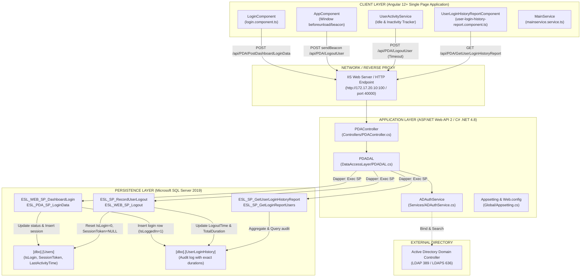
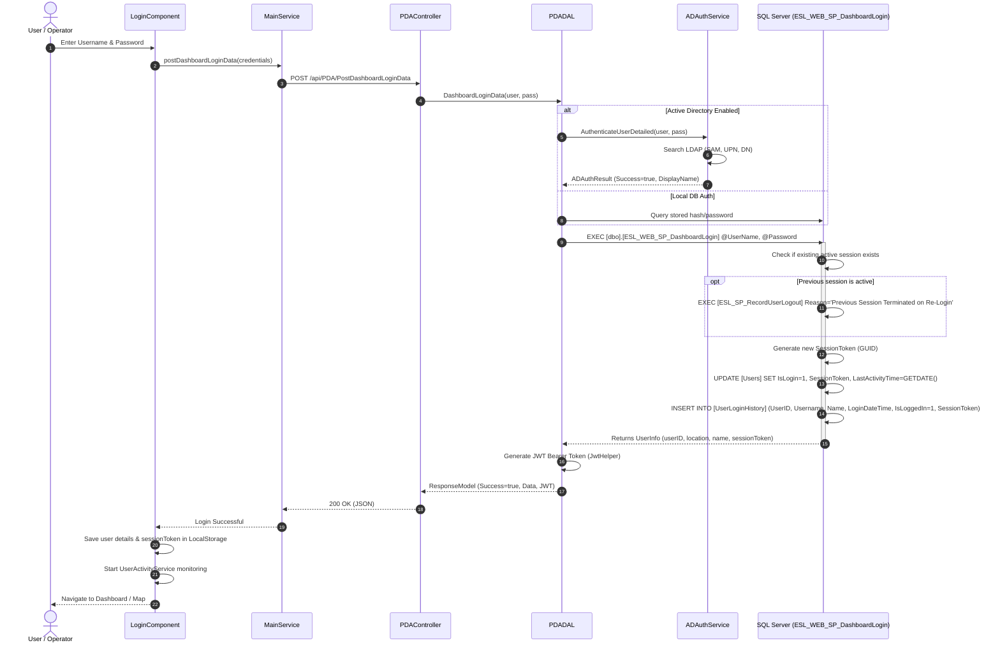
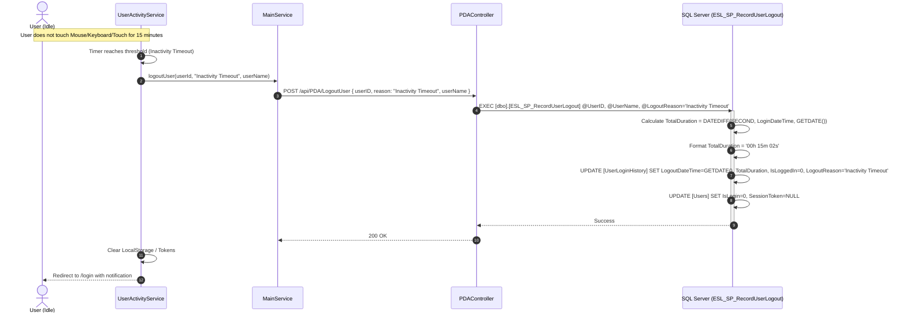
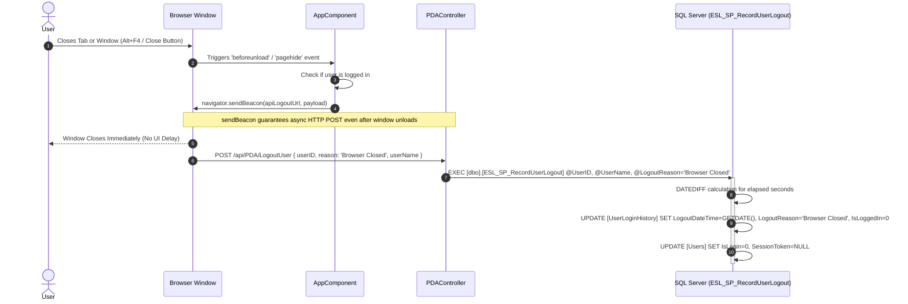
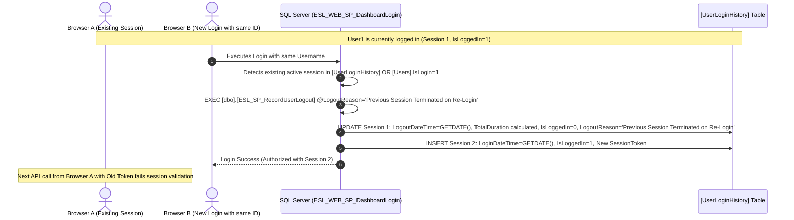
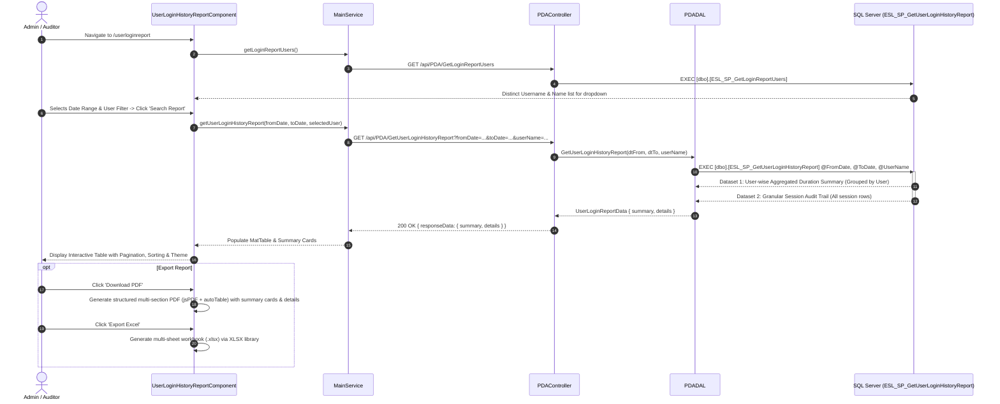

# ESL User Session Tracking & Login History System
## System Architecture & Technical Documentation

---

### Table of Contents
1. [Executive Summary & High-Level Architecture](#1-executive-summary--high-level-architecture)
2. [End-to-End Architectural Diagram](#2-end-to-end-architectural-diagram)
3. [Process Flow Diagrams (Mermaid)](#3-process-flow-diagrams)
   - [3.1 User Login & Active Directory Authentication Flow](#31-user-login--active-directory-authentication-flow)
   - [3.2 User Inactivity Auto-Logout Flow](#32-user-inactivity-auto-logout-flow)
   - [3.3 Browser / Tab Close (Beacon API) Flow](#33-browser--tab-close-beacon-api-flow)
   - [3.4 Concurrent Session & Re-Login Termination Flow](#34-concurrent-session--re-login-termination-flow)
   - [3.5 User Login History & Duration Report Generation Flow](#35-user-login-history--duration-report-generation-flow)
4. [User Interface (UI) Layer - Angular](#4-user-interface-ui-layer---angular)
   - [4.1 Components & Life Cycle](#41-components--life-cycle)
   - [4.2 Angular Services](#42-angular-services)
   - [4.3 Routing & Navigation](#43-routing--navigation)
5. [Application Programming Interface (API) Layer - ASP.NET Web API](#5-application-programming-interface-api-layer---aspnet-web-api)
   - [5.1 Controllers](#51-controllers)
   - [5.2 Business Logic & Data Access (DAL)](#52-business-logic--data-access-dal)
   - [5.3 Active Directory Service](#53-active-directory-service)
   - [5.4 DTOs & Models](#54-dtos--models)
6. [Database Layer - Microsoft SQL Server](#6-database-layer---microsoft-sql-server)
   - [6.1 Tables & Indices](#61-tables--indices)
   - [6.2 Stored Procedures](#62-stored-procedures)
7. [Traceability Matrix (UI -> API -> DAL -> SP -> DB)](#7-traceability-matrix)

---

### 1. Executive Summary & High-Level Architecture

The **ESL User Session Tracking & Login History System** provides real-time auditability, single-session integrity, session duration calculation, and comprehensive reporting across the ESL Ladle Movement Dashboard and Handheld/PDA applications.

#### Key Capabilities:
- **Zero Ghost Sessions**: Handles standard logouts, browser/tab window termination (`navigator.sendBeacon`), workstation inactivity timeouts, and concurrent re-logins.
- **Accurate Duration Auditing**: Calculates exact session durations (`HHh MMm SSs`) down to the second on the database server.
- **Dual Authentication**: Integrates Active Directory (LDAP/LDAPS/Kerberos) with local fallback.
- **Multi-Dataset Reporting**: Two-tier report displaying user-level aggregate metrics alongside granular session audit trails with PDF and Excel exports.

---

### 2. End-to-End Architectural Diagram



---

### 3. Process Flow Diagrams

#### 3.1 User Login & Active Directory Authentication Flow



---

#### 3.2 User Inactivity Auto-Logout Flow



---

#### 3.3 Browser / Tab Close (Beacon API) Flow



---

#### 3.4 Concurrent Session & Re-Login Termination Flow



---

#### 3.5 User Login History & Duration Report Generation Flow



---

### 4. User Interface (UI) Layer - Angular

#### 4.1 Components & Life Cycle

| Component | File Path | Responsibility |
| :--- | :--- | :--- |
| **`LoginComponent`** | [`login.component.ts`](file:///d:/ESL/Deeptesh/ESL_git/UI/src/app/pages/login/login.component.ts) | Collects credentials, invokes login API, initializes session storage and activity listeners upon successful response. |
| **`AppComponent`** | [`app.component.ts`](file:///d:/ESL/Deeptesh/ESL_git/UI/src/app/app.component.ts) | Hosts the top-level application lifecycle. Registers `@HostListener('window:beforeunload')` and `@HostListener('window:pagehide')` to dispatch `navigator.sendBeacon` upon window/tab destruction. |
| **`UserLoginHistoryReportComponent`** | [`user-login-history-report.component.ts`](file:///d:/ESL/Deeptesh/ESL_git/UI/src/app/pages/user-login-history-report/user-login-history-report.component.ts) | Full reporting interface: Date range pickers, user dropdown filter, KPI statistic tiles (Total Logins, Total Duration, Active Users), session audit table (`MatTable`, `MatPaginator`, `MatSort`), client-side PDF and Excel export engines. |
| **`NavbarComponent`** | [`navbar.component.html`](file:///d:/ESL/Deeptesh/ESL_git/UI/src/app/pages/navbar/navbar.component.html) | Main sidebar and top navigation menu. Links to `#/userloginreport` under the *ESL Reports* collapsible menu. Handles manual logout button click. |

#### 4.2 Angular Services

##### `MainService` ([`mainservice.service.ts`](file:///d:/ESL/Deeptesh/ESL_git/UI/src/app/pages/service/mainservice.service.ts))
- **`postDashboardLoginData(model)`**: Dispatches `POST` request to `LTS/PostDashboardLoginData`.
- **`logoutUser(userId, reason, userName)`**: Dispatches `POST` request to `LTS/LogoutUser` with session payload.
- **`getUserLoginHistoryReport(fromDate, toDate, userName?)`**: Dispatches `GET` request to `LTS/GetUserLoginHistoryReport` with query parameters.
- **`getLoginReportUsers()`**: Dispatches `GET` request to `LTS/GetLoginReportUsers` for populating the filter dropdown.

##### `UserActivityService` ([`user-activity.service.ts`](file:///d:/ESL/Deeptesh/ESL_git/UI/src/app/pages/service/user-activity.service.ts))
- Observes global DOM events: `mousemove`, `mousedown`, `keydown`, `touchstart`, `scroll`.
- Resets internal debounce timer on each interaction.
- If no event is intercepted within `INACTIVITY_TIMEOUT_MS` (e.g., 15 minutes), automatically triggers `logoutUser(userId, 'Inactivity Timeout', userName)`.

#### 4.3 Routing & Navigation

In [`app-routing.module.ts`](file:///d:/ESL/Deeptesh/ESL_git/UI/src/app/app-routing.module.ts):
```typescript
{
    path: 'userloginreport',
    component: UserLoginHistoryReportComponent,
    canActivate: [AuthGuard] // Protected route
}
```

---

### 5. Application Programming Interface (API) Layer - ASP.NET Web API

#### 5.1 Controllers

##### `PDAController` ([`PDAController.cs`](file:///d:/ESL/Deeptesh/ESL_git/API/ESL_Api/Controllers/PDAController.cs))

| HTTP Method | Route | Method Signature | Purpose |
| :--- | :--- | :--- | :--- |
| `POST` | `api/PDA/PostDashboardLoginData` | `PostDashboardLoginData(LoginModel model)` | Authenticates user via AD / Local DB and creates a login session in `UserLoginHistory`. |
| `POST` | `api/PDA/LogoutUser` | `LogoutUser(LogoutRequestModel model)` | Terminates an active session with specific termination reasons. |
| `GET` | `api/PDA/GetUserLoginHistoryReport` | `GetUserLoginHistoryReport(string fromDate, string toDate, string userName = null)` | Returns 2-dataset report (Summary + Detail sessions). |
| `GET` | `api/PDA/GetLoginReportUsers` | `GetLoginReportUsers()` | Returns list of distinct users for UI report filter. |

#### 5.2 Business Logic & Data Access (DAL)

##### `IPDADAL` & `PDADAL` ([`IPDADAL.cs`](file:///d:/ESL/Deeptesh/ESL_git/API/ESL_Api/IDataAccessLayer/IPDADAL.cs), [`PDADAL.cs`](file:///d:/ESL/Deeptesh/ESL_git/API/ESL_Api/DataAccessLayer/PDADAL.cs))

1. **`DashboardLoginData(string username, string password)`**:
   - Decrypts client payload.
   - Evaluates `Appsetting.UseADAuthentication`. If enabled, calls `ADAuthService.AuthenticateUserDetailed`.
   - Executes stored procedure specified in `Appsetting.WEB_SP_DashboardLogin` (defaults to `[dbo].[ESL_WEB_SP_DashboardLogin]`) using **Dapper** `QueryMultiple`.
   - Generates JWT bearer token (`JwtHelper.GenerateToken`) and populates `DashboardLoginResponseModel`.

2. **`WEBLogoutUser(string userID, string reason, string userName)`**:
   - Executes stored procedure `[dbo].[ESL_SP_RecordUserLogout]` with Dapper `Execute`.
   - Guarantees termination in both `[dbo].[UserLoginHistory]` and `[dbo].[Users]`.

3. **`GetUserLoginHistoryReport(DateTime fromDate, DateTime toDate, string userName)`**:
   - Executes `[dbo].[ESL_SP_GetUserLoginHistoryReport]` via Dapper `QueryMultiple`.
   - Reads Dataset 1 into `List<UserLoginSummaryModel>`.
   - Reads Dataset 2 into `List<UserLoginDetailModel>`.
   - Returns consolidated `UserLoginReportData`.

4. **`GetLoginReportUsers()`**:
   - Executes `[dbo].[ESL_SP_GetLoginReportUsers]` via Dapper `Query<UserDropdownItem>`.

#### 5.3 Active Directory Service

##### `ADAuthService` ([`ADAuthService.cs`](file:///d:/ESL/Deeptesh/ESL_git/API/ESL_Api/Services/ADAuthService.cs))
- **`AuthenticateUserDetailed(userName, password)`**:
  - Connects to Active Directory via `System.DirectoryServices.Protocols.LdapConnection` using service credentials.
  - Searches multi-base LDAP directories (`OU=Electro Steels Limited`, `DC=ESL01`, `DC=vedantaresource`, `DC=local`).
  - Resolves `sAMAccountName`, `userPrincipalName`, `distinguishedName`, and `displayName`.
  - Verifies Account Control flags (detects disabled accounts `UAC & 2 != 0`).
  - Performs direct credential authentication candidates (Domain Logon `DOMAIN\sam`, UPN, LDAP Bind).
  - Includes fallback to `System.DirectoryServices.DirectoryEntry`.
  - Parses Windows AD error codes (`52e` = Invalid password, `775` = Account locked, `532` = Password expired).

#### 5.4 DTOs & Models

##### Login & Session Models ([`LoginModels.cs`](file:///d:/ESL/Deeptesh/ESL_git/API/ESL_Api/Models/LoginModels.cs))
```csharp
public class LogoutRequestModel
{
    public string userID { get; set; }
    public string userName { get; set; }
    public string reason { get; set; } = "Manual Logout";
}

public class UserLoginReportData
{
    public List<UserLoginSummaryModel> summary { get; set; } = new List<UserLoginSummaryModel>();
    public List<UserLoginDetailModel> details { get; set; } = new List<UserLoginDetailModel>();
}

public class UserLoginSummaryModel
{
    public string Username { get; set; }
    public string Name { get; set; }
    public int TotalLogins { get; set; }
    public int TotalDurationSeconds { get; set; }
    public string TotalDurationFormatted { get; set; }
    public DateTime? LastLoginDateTime { get; set; }
    public bool IsCurrentlyOnline { get; set; }
}

public class UserLoginDetailModel
{
    public long Id { get; set; }
    public string UserID { get; set; }
    public string Username { get; set; }
    public string Name { get; set; }
    public DateTime LoginDateTime { get; set; }
    public DateTime? LogoutDateTime { get; set; }
    public string TotalDuration { get; set; }
    public int TotalDurationSeconds { get; set; }
    public string LogoutReason { get; set; }
    public bool IsLoggedIn { get; set; }
    public DateTime ServerDateTime { get; set; }
}
```

---

### 6. Database Layer - Microsoft SQL Server

#### 6.1 Tables & Indices

##### Table 1: `[dbo].[UserLoginHistory]`
Stores every login session and audit record.

| Column Name | Data Type | Nullable | Constraints / Default | Description |
| :--- | :--- | :--- | :--- | :--- |
| `Id` | `BIGINT` | `NO` | `PRIMARY KEY IDENTITY(1,1)` | Unique Auto-incrementing Session ID |
| `UserID` | `NVARCHAR(100)` | `YES` | - | Unique GUID identifier of user |
| `Username` | `NVARCHAR(100)` | `NO` | - | Login Username / SAM account |
| `Name` | `NVARCHAR(150)` | `YES` | - | Full Name (`FirstName + ' ' + LastName`) |
| `LoginDateTime` | `DATETIME` | `NO` | `DEFAULT (GETDATE())` | Exact server timestamp of login |
| `LogoutDateTime` | `DATETIME` | `YES` | `NULL` | Timestamp of session termination |
| `TotalDuration` | `NVARCHAR(50)` | `YES` | `NULL` | Formatted duration (`00h 12m 45s`) |
| `TotalDurationSeconds`| `INT` | `YES` | `NULL` | Raw session duration in integer seconds |
| `ServerDateTime` | `DATETIME` | `NO` | `DEFAULT (GETDATE())` | Server baseline insertion timestamp |
| `LogoutReason` | `NVARCHAR(100)` | `YES` | `NULL` | Cause of session termination |
| `IsLoggedIn` | `BIT` | `NO` | `DEFAULT (1)` | `1` = Active Session, `0` = Terminated |
| `SessionToken` | `NVARCHAR(100)` | `YES` | - | GUID session token for concurrency validation |

**Indices**:
- `IX_UserLoginHistory_Username_IsLoggedIn`: `ON ([Username], [IsLoggedIn])` — Accelerates concurrency checks and active session lookups.
- `IX_UserLoginHistory_UserID_IsLoggedIn`: `ON ([UserID], [IsLoggedIn])` — Accelerates user ID-based logout terminations.
- `IX_UserLoginHistory_LoginDateTime`: `ON ([LoginDateTime])` — Accelerates date-range report queries.

---

##### Table 2: `[dbo].[Users]` (Session tracking columns)
The master user authentication table.

| Column Name | Data Type | Nullable | Purpose in Session Management |
| :--- | :--- | :--- | :--- |
| `UserID` | `uniqueidentifier` | `NO` | Primary key of the user. |
| `UserName` | `nvarchar(50)` | `NO` | Unique login username. |
| `FirstName` | `nvarchar(50)` | `YES` | User first name. |
| `LastName` | `nvarchar(50)` | `YES` | User surname. |
| `IsLogin` | `bit` | `YES` | `1` if currently logged in, `0` or `NULL` if logged out. |
| `SessionToken` | `nvarchar(100)` | `YES` | GUID token assigned to the current active session. |
| `LastActivityTime` | `datetime` | `YES` | Timestamp of the most recent user action. |

---

#### 6.2 Stored Procedures

##### 1. `[dbo].[ESL_WEB_SP_DashboardLogin]`
- **Called By**: API `PDADAL.DashboardLoginData`
- **Actions**:
  1. Validates user existence and `IsActive = 1`.
  2. Checks if previous session exists in `[Users]` or `[UserLoginHistory]`.
  3. If previous session found, invokes `[dbo].[ESL_SP_RecordUserLogout]` with reason `'Previous Session Terminated on Re-Login'`.
  4. Generates new `SessionToken = CAST(NEWID() AS NVARCHAR(100))`.
  5. Updates `[Users]` (`IsLogin = 1`, `SessionToken`, `LastActivityTime = GETDATE()`).
  6. **Inserts new row** into `[dbo].[UserLoginHistory]` with `IsLoggedIn = 1`.
  7. Returns `userID`, `userName`, `userLocationId`, `userLocationName`, `userFirstName`, `sessionToken`.

##### 2. `[dbo].[ESL_PDA_SP_LoginData]`
- **Called By**: API Handheld / PDA Login
- **Actions**: Performs identical session closure and `UserLoginHistory` insertion as `ESL_WEB_SP_DashboardLogin`, plus returns authorized module mappings for the handheld terminal.

##### 3. `[dbo].[ESL_SP_RecordUserLogout]`
- **Called By**: `ESL_WEB_SP_Logout`, `ESL_PDA_SP_Logout`, and direct API `PDADAL.WEBLogoutUser`
- **Parameters**: `@UserID`, `@UserName`, `@LogoutReason`
- **Actions**:
  1. Resolves missing `@UserName` or `@UserID` from `[Users]`.
  2. Updates all active records (`IsLoggedIn = 1`) in `[dbo].[UserLoginHistory]`:
     - `LogoutDateTime = GETDATE()`
     - `TotalDurationSeconds = DATEDIFF(SECOND, [LoginDateTime], GETDATE())`
     - `TotalDuration = 'XXh YYm ZZs'`
     - `LogoutReason = @LogoutReason`
     - `IsLoggedIn = 0`
  3. Updates `[dbo].[Users]` (`IsLogin = 0`, `SessionToken = NULL`).

##### 4. `[dbo].[ESL_WEB_SP_Logout]` & `[dbo].[ESL_PDA_SP_Logout]`
- Wrapper procedures that forward parameters to `[dbo].[ESL_SP_RecordUserLogout]`.

##### 5. `[dbo].[ESL_SP_GetUserLoginHistoryReport]`
- **Called By**: API `PDADAL.GetUserLoginHistoryReport`
- **Parameters**: `@FromDate DATETIME`, `@ToDate DATETIME`, `@UserName NVARCHAR(100) = NULL`
- **Actions**:
  - Automatically expands `@ToDate` to `23:59:59.997` if time portion is `00:00:00`.
  - **Dataset 1**: Grouped by `Username`, aggregates total logins, total duration in seconds and formatted (`XXh YYm ZZs`), latest login timestamp, and online status.
  - **Dataset 2**: Detailed audit log of every individual session ordered descending by `LoginDateTime`. Dynamically calculates active session duration in real time if `IsLoggedIn = 1`.

##### 6. `[dbo].[ESL_SP_GetLoginReportUsers]`
- **Called By**: API `PDADAL.GetLoginReportUsers`
- **Actions**: Selects distinct `Username` and `Name` from `[dbo].[UserLoginHistory]` to populate the UI dropdown filter.

---

### 7. Traceability Matrix

| Feature / Trigger | UI Component & Method | API Endpoint & Method | DAL Method | Stored Procedure Executed | Tables Affected |
| :--- | :--- | :--- | :--- | :--- | :--- |
| **Web Dashboard Login** | `LoginComponent.login()` | `POST api/PDA/PostDashboardLoginData` | `PDADAL.DashboardLoginData` | `[dbo].[ESL_WEB_SP_DashboardLogin]` | `[Users]`, `[UserLoginHistory]` |
| **Handheld / PDA Login** | Mobile App Login Screen | `POST api/PDA/LoginData` | `PDADAL.LoginData` | `[dbo].[ESL_PDA_SP_LoginData]` | `[Users]`, `[UserLoginHistory]` |
| **Manual User Logout** | `NavbarComponent.logout()` | `POST api/PDA/LogoutUser` | `PDADAL.WEBLogoutUser` | `[dbo].[ESL_SP_RecordUserLogout]` | `[Users]`, `[UserLoginHistory]` |
| **Inactivity Auto-Logout** | `UserActivityService.checkIdle()` | `POST api/PDA/LogoutUser` | `PDADAL.WEBLogoutUser` | `[dbo].[ESL_SP_RecordUserLogout]` | `[Users]`, `[UserLoginHistory]` |
| **Browser / Tab Close** | `AppComponent.beforeunload` (sendBeacon) | `POST api/PDA/LogoutUser` | `PDADAL.WEBLogoutUser` | `[dbo].[ESL_SP_RecordUserLogout]` | `[Users]`, `[UserLoginHistory]` |
| **Concurrent Re-Login** | `LoginComponent.login()` | `POST api/PDA/PostDashboardLoginData` | `PDADAL.DashboardLoginData` | `[dbo].[ESL_WEB_SP_DashboardLogin]` | `[Users]`, `[UserLoginHistory]` |
| **Fetch Report Data** | `UserLoginHistoryReportComponent.fetchReport()` | `GET api/PDA/GetUserLoginHistoryReport` | `PDADAL.GetUserLoginHistoryReport` | `[dbo].[ESL_SP_GetUserLoginHistoryReport]` | `[UserLoginHistory]` (Read) |
| **Fetch Filter Users** | `UserLoginHistoryReportComponent.loadUsers()` | `GET api/PDA/GetLoginReportUsers` | `PDADAL.GetLoginReportUsers` | `[dbo].[ESL_SP_GetLoginReportUsers]` | `[UserLoginHistory]` (Read) |
